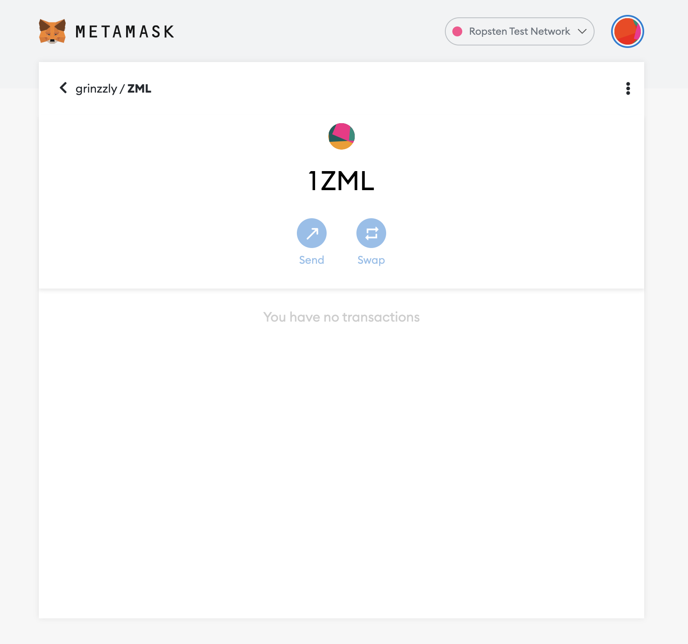

<h1 align="center">Zamulka NFT Token</h1>

    
        The little token that NFT. Coded by
        <a href="https://github.com/Grinzzly">Grinzzly</a>
    
     
     
    
     
     

# Description

Creating my own non-fungible NFT using alchemy.

# Technology in use:

* OpenZeppelin contracts
* Web 3 Alchemy